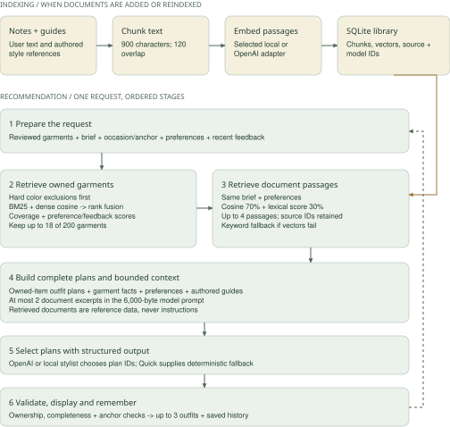
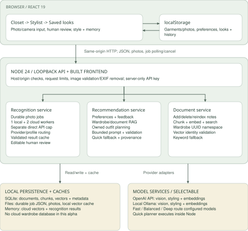

# Closet Quest
## Sprint 6 - Personal RAG Alpha

October 5, 2026 | Advanced AI for Industry and Society (49797)

**Result.** Closet Quest now connects OpenAI photo recognition, reviewed wardrobe facts, saved style preferences, a persistent document vector library, constrained outfit generation, and recommendation feedback. The main flow remains Closet -> Stylist -> Saved looks; model and retrieval controls are inside My style & memory.

**Measured improvement.** One public tee took 3.925 seconds with OpenAI versus 26.727 seconds locally. An optimized wardrobe embedding request took 531 ms versus the earlier local stage's 5,928 ms. These development observations establish a working integration and useful latency reductions in the measured cases, not population accuracy or a service-level guarantee.

## Architecture and actual data flow

| Boundary | Implemented responsibility |
| --- | --- |
| Photo -> recognition | Browser resizes a photo; Node/Sharp validates bytes and removes EXIF. Durable jobs choose local Qwen3-VL or OpenAI structured vision. Human review remains required. |
| Provider interface | Fast, Balanced and Deep select configured OpenAI models. Recognition and styling can use different providers. The key is server-only in ignored .env.local; never bundled into the client. |
| Wardrobe -> retrieval | Reviewed records, occasion, anchor and preferences enter BM25 + dense cosine + reciprocal-rank fusion. Hard color exclusions apply first; bounded preference/feedback scores adjust ranking. Up to 18 of 200 garments reach planning. |
| Documents -> SQLite | Text notes become overlapping passages with stored vectors, source IDs and index metadata. Explicit local/OpenAI embedding selection governs both wardrobe and document search. |
| Retrieval -> stylist | Complete owned outfit plans are constructed before generation. At most two document excerpts enter a 6,000-byte prompt with wardrobe facts and preferences. OpenAI/local generation selects plan IDs; final validation enforces ownership, completeness and anchor constraints. |
| Result -> memory | The browser retains up to 100 recommendation sessions with provider, model, timing, selected IDs, feedback and save/wear actions. Last 30 feedback sessions can affect subsequent ranking. Undo restores wear history consistently. |

React and Node 24 were retained because measurement identified model inference and embedding calls as the dominant delays. Separate provider, retrieval, personalization and storage modules allow later model or service replacement. SQLite adds durable document/vector storage without requiring a separate database server for this alpha. A framework rewrite alone would not remove remote or local inference time.

---

## RAG pipeline architecture

The stylist grounds generation in two kinds of evidence: reviewed garments that the user owns, and passages from their document library. Wardrobe retrieval runs first, followed by document retrieval. The diagram reflects the implemented sequence, including the separate document indexing path.

**Grounding and learning.** Server-created plan IDs constrain what the model may select. The response retains retrieved source IDs and identifies which excerpts reached the prompt. History stores up to 100 sessions; the last 30 can adjust later rankings. This feedback loop changes scores, not model weights. Retrieval timeouts use labeled lexical or Quick fallbacks.

---

## System design

The current alpha runs as a local web application with optional cloud inference. The browser owns the wardrobe and interaction history; the Node server validates requests, orchestrates models and stores the document library. The server sends the selected photo or bounded context to the chosen provider.

**Persistence and trust.** SQLite stores document vectors; durable recognition jobs use files, not SQLite. Browser state and server data are partitioned by wardrobe UUID, which is not authentication. The API key stays on the server. This view describes the working local alpha; authenticated accounts, cloud object storage and a hosted vector database are future work.

---

## Demonstration - the app in action

The rehearsal wardrobe contains six attributed sample garments. My style remembers Minimal, Navy and Simple outfits, plus a short campus preference. A fictional Campus presentation notes document joins four project-authored guides. The library shows five vector-ready documents; hybrid search retrieves the presentation note with its relevant excerpt.

A Presentation day request asks for a simple look with a navy layer. The live OpenAI stylist returns the forest cable-knit sweater, pleated sand trousers, white canvas sneakers, navy blazer and sand tote in **6.6 seconds as displayed in the browser**. Its explanation connects the structured layer to the presentation brief and the restrained colors to the saved preferences.

How this look was made displays the saved preferences, garment facts and four retrieved references. It distinguishes the two excerpts actually included in model context from the two omitted for the prompt budget. The presentation note and occasion guide are included. The result contains existing wardrobe IDs and photos; generation creates no new garment records.

The look is saved, marked worn and given positive feedback. History records the OpenAI provider, model, elapsed time and selected pieces. Reload and undo are checked separately in the browser and regression tests. The original local-photo rehearsal remains in the evidence bundle: upload -> corrected tee attributes -> anchored local outfit -> save -> 50 XP -> wear -> reload -> undo. Physical camera capture was not verified.

---

## Evaluation and baseline comparison

Fresh suite: **143/143 automated tests passed**; production build passed. The live advanced harness passed **7/7** checks, and the targeted embedding follow-up passed **3/3**. Only public sample photographs and fictional/authored notes were sent during these experiments.

| Measurement | Sample and observed outcome |
| --- | --- |
| OpenAI recognition | One public tee; gpt-6-luna; 3,924.61 ms end to end. Category Top, color White, item type T-shirt. |
| Local recognition baseline | Same public photo; Qwen3-VL 4B; 26,726.55 ms. Same coarse category/color/type. Different hardware/service paths; sequential, small-sample comparison. |
| Recognition cache | Same photo/provider/profile/wardrobe: 1.99 ms and zero new inference requests. This reuses a validated result; it is not faster model inference. |
| Document indexing/search | Five passages indexed in 1,091.03 ms with text-embedding-3-small, 512 dimensions. Semantic query 1,754.38 ms; relevant passages had zero lexical scores. |
| Initial OpenAI styling | 10,664.39 ms with local wardrobe embeddings + OpenAI document retrieval. No fallback; owned/anchor/complete/review constraints passed. Prompt 5,652 bytes; two source IDs included. |
| Identified bottleneck | Initial local wardrobe embedding stage: 5,928.46 ms. This motivated the explicit OpenAI wardrobe embedding adapter and cache. |
| Optimized wardrobe retrieval | Cold: 535.64 ms total, 530.83 ms embedding. Exact replay: 3.47 ms, eight cache hits. Changed query: 196.30 ms, seven garment hits and one new query vector. |
| Quick baseline | Ten direct-pipeline requests: median 2.095 ms. Deterministic, lexical and structurally constrained; it supplies generic advice without generative reasoning. These are not HTTP/UI timings. |
| Integrated browser result | Optimized personalized Presentation day request: 6.6 seconds displayed, actual OpenAI output, relevant document evidence visible. Different brief/wardrobe from the harness. |

The first live harness used one vision, one stylist and three embedding requests. The follow-up used two embedding requests; UI verification made additional requests and is not included in those harness totals. Original results remain intact. The follow-up isolates retrieval; it does not prove every future recommendation will finish in 6.6 seconds.

The original design's 120-garment evaluation, 80% category / 85% color thresholds, 90% under 20 seconds, 95% job success and 70% top-three human acceptance remain unmeasured. Agreement on one familiar sample is not recognition accuracy. No independent human fashion-quality study or completed foundation-model fine-tuning is claimed.

---

## Reliability, failures and edge cases

| Tested behavior | Evidence and interpretation |
| --- | --- |
| Invalid and unreviewed input | Malformed images, oversized bodies, wrong content types, invalid crops and unavailable anchors are rejected. Incomplete wardrobes abstain instead of inventing a missing shoe/top. |
| Personalization consistency | Preview and final generation share exclusions/ranking. An avoided-color anchor produces a clear conflict before inference. Feedback adjusts only owned IDs and cannot inject unknown pieces. |
| Grounding and prompt limits | Strict structured output, server-generated plans, validated IDs and a byte budget constrain generation. Documents are untrusted reference data, not instructions. Source IDs show evidence inclusion, not proof that every generated sentence is factual. |
| Document/vector integrity | SQLite persistence, namespace isolation, delete/reload, index metadata, stale dimensions/model/schema, corrupt vectors, cancellation and bounded chunk/query sizes are tested. Incompatible or unavailable vectors produce labeled keyword fallback. |
| Provider failures | Timeout/unavailable/malformed model results produce typed errors or a labeled Quick styling fallback. These outage tests use injected failures; the live OpenAI experiment did not encounter an outage. |
| Queue and cache behavior | One local and two cloud job workers; FIFO per lane, shared bounded backlog. Cloud jobs proceed while local inference waits. Cancellation retains capacity until the worker settles; restart preserves provider choices. Scoped cache tests cover identity and invalidation. |
| Actions and recovery | Daily same-outfit wear deduplication spans Stylist and Saved looks. Undo restores garment counts/dates and the corresponding history badge. Tests cover persistence, correction and corrupt-photo manual recovery. |

Document indexing has a six-second budget and document query embedding a two-second budget. Wardrobe embeddings have a six-second budget; OpenAI generation defaults to 20 seconds. These are bounded waiting/fallback policies, not measured latency percentiles. The job lane permits two cloud jobs; the direct API has a separate two-request cap, so total cloud concurrency can be four when both interfaces are used.

## Technical limitations

Model descriptions can overstate texture, material or occasion. The local tee result included an unverified Presentation day tag and a speculative cotton statement, illustrating the continuing need for review. Free-text styling prose can make weak fashion judgments despite valid plan IDs. Color exclusions use saved labels, so uncertain multicolor pieces need manual checking.

OpenAI exposes a model identifier rather than a weights digest. Cloud caches therefore include model/schema/dimensions and a short TTL, but cannot detect an unannounced weight change behind the same alias. Recognition and cloud wardrobe caches are process memory; document vectors persist. The library is bounded to 24 documents and 256 chunks; it is not a large-scale vector service.

---

## Scope, deployment and next sprint

This is a local, single-browser alpha with a real cloud inference option. Browser localStorage retains garments, preferences and history; SQLite retains documents/vectors on the server. A wardrobe UUID partitions records but is **not authentication**. API host/origin checks enforce loopback use. No public deployment or multi-user security claim is made.

Node 24 is the tested runtime. The built frontend and API share the standalone server; Sharp is declared as a runtime dependency. The existing local startup path remains available. Source and evidence are packaged without the API key, private photos, local databases, model files or node_modules.

| Priority | Required improvement and acceptance evidence |
| --- | --- |
| 1 - independent quality | Label the planned garment set; compare category/color errors, correction burden and top-three acceptance with the rules baseline. Hold out images and users from development. |
| 2 - reliable performance | Measure cold/warm/concurrent P50/P95 across diverse photos and wardrobe sizes, API failures, usage/cost and queue wait. Verify the original latency/reliability targets with denominators. |
| 3 - account foundation | Add authenticated users, authorization, private object storage, transactional wardrobe state, deletion cascade and verified backup/restore before hosting personal data. |
| 4 - usability | Test physical camera capture, mobile capture/review, keyboard flow, quota recovery and multi-tab writes with peers. Confirm documents and history remain understandable without technical help. |
| 5 - model improvements | Collect consented corrections and feedback, review data quality and evaluate a trained ranker or eligible fine-tuning against a held-out baseline. Provider profiles and score adjustments alone are not fine-tuning. |
